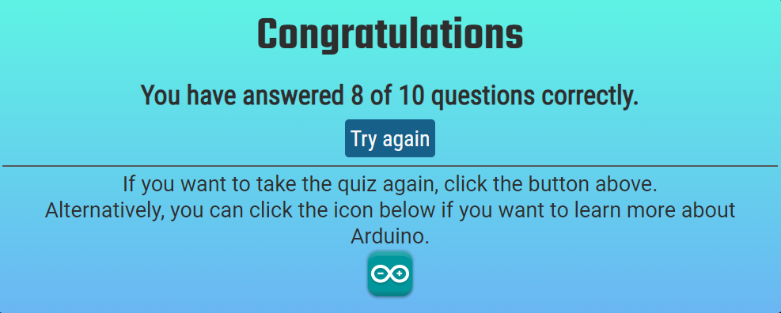

# **Arduino Quiz**
**[Click here to visit the Arduino Quiz website](https://kwalczak80.github.io/Arduino-Quiz)** 

If you are passionate about the Arduino microcontroller and would like to test your knowledge of it, then I would like to invite you to take this quiz by clicking the link above. The quiz requires the user to answer ten Arduino-related questions based on different knowledge categories. I hope you will have great fun. Enjoy!!!

# **User Experience (UX)**

<h2>User Goals</h2>

<ul>
   <li>Visually appealing website.</li>
   <li>The website has to be easy and intuitive to use.</li>
   <li>The website has to work well on different screen sizes, such as mobile phones, tablets, and desktops.</li>
   <li>The quiz rules are clearly explained.</li>
   <li>The quiz progress is displayed on the screen in the appropriate form.</li>
</ul>

<h2>User Stories</h2>
<ul>
   <li>
      <strong>User Goals</strong>
      <ul>
         <li>As a user, I would like to play this quiz regardless of the device screen size I'm using.</li>
         <li>As a user, I would like to easily understand the quiz rules.</li>
         <li>As a user, I would like to track the quiz progress.</li>
         <li>As a user, I would like to know when the quiz is complete.</li>
         <li>As a user, I would like to have a chance to retake the quiz to improve my score.</li>
         <li>As a user, I would like to visit the official Arduino website where I can information regarding the questions asked in the quiz.</li>
      </ul>
    </li>
</ul>

<h2>Site owners Goals</h2>

<ul>
   <li>To have an appealing website where Arduino users can check their knowledge.</li>
   <li>To have a website that is easy to navigate and has a lot of functionality so that the user can enjoy the quiz.</li>
   <li>Update the quiz questions regularly, as it may prompt the user to return to the website.</li>
</ul>

# **Wireframe**
<ul>
   <li>The Balsamiq software was used to create a visual layout of the Arduino Quiz website. You can check the wireframes below.</li>
   <ul>
      <li>The desktop wireframes showing all the quiz sections can be found <a href="assets/wireframes/arduino-quiz-wireframe-for-desktop-all-sections.pdf">here</a></li>
      <li>The tablet/ipad wireframes showing all the sections can be found <a href="assets/wireframes/arduino-quiz-wireframe-for-tablet-all-sections.pdf">here</a></li>
      <li>The mobile wireframes showing all the quiz sections found <a href="assets/wireframes/arduino-quiz-wireframe-for-mobile-all-sections.pdf">here</a></li>
   </ul>
</ul>

# **Design**
   <ul>
      <li><strong>Typography</strong></li>
      <ul>
         <li>I visited the <a href="https://fonts.google.com/">Google fonts </a> website to explore available font options for my project. After consideration, three different font types were chosen to be used in different sections of the website.</li>
         <li>The <a href="https://fonts.google.com/?query=teko">Teko</a> font is used to display the quiz name.</li>
         <li>The <a href="https://fonts.google.com/?query=Roboto+Condensed+">Roboto Condensed</a> font is used to display the quiz questions.</li>
         <li>The <a href="https://fonts.google.com/?query=Roboto">Roboto</a> font is used to display all other text information.</li>
         <li>All the fonts mentioned above were imported from the official Google fonts website.</li>
      </ul>
   </ul>
 <ul>
      <li><strong>Background</strong></li>
      <ul>
         <li>I initially intended to use a picture as the background for the page. Nevertheless, since the quiz is about electronic devices, I dropped this idea as I wanted to have a more attractive website. Thus, I decided to implement an animated background that is more relevant to the website's topic. After doing some research, I found an interesting video showing some sort of motherboard electronic circuit with animated blue lines indicating the flow of electric current. Since this video is aligned with the website topic and at the same time does not distract the user from other parts of the website, I decided to use it as a looped video background for the website.</li>
      </ul>
</ul>

 <ul>
      <li><strong>Colour Scheme</strong></li>
      <ul>
      <li>Gradient</li>
         <ul>
         <li>I used <a href="https://cssgradient.io/">CSS gradient</a> website to create a gradient background for my project. This gradient is used as a background for the quiz information being displayed on the page.
The contrast checker was used to make sure that the contrast is sufficient and that there are no issues with the website readability.
         </li>

         </ul>
      <li>Colour Scheme</li>

         <ul>
            <li>#1E1E1E – color was used for all the text information being displayed on the website. A contrast checker was also used in this case to make sure that the text and background colors do not create issues with website readability.</li>
            <li>#17608A - color was used as a background for all the buttons used on the website.</li>
            <li>#F7F7F7 - color was used to display the text information on the buttons</li>
            <li>#088308 - color was used to highlight correctly answered question</li>
            <li>#D10F0F - color was used to highlight incorrectly answered question</li>
         </ul>
      </ul>
</ul>

# **Site Structure**

This website is designed to be a one-page site. Based on the user activity, relevant sections of the website are being shown or hidden. This is done when the user clicks on the button in order to proceed through the quiz. To start the quiz user must first enter their name which will be then populated on the welcome screen where the rules of the quiz are displayed. Once the user is familiar with the rules, they can hit the “I understand. Let’s play” button to start the quiz. Questions are presented one by one with the current question number shown on the screen. In order to move to the next question, the current question must be answered. The scoring area helps the user to track which questions were answered correctly and which were not. Upon completion of the quiz, a summary of correctly answered questions is displayed on the screen. At this point, the user has two choices; to do the quiz again by clicking on the “Try again” button or to visit the Arduino official website by clicking on the Arduino icon. This will open the Arduino official website in a new window.

# **Features**
   <ul>
      <li><strong>Welcome section</strong></li>
      <ul>
      <li>At the beginning of the quiz, the welcome section is displayed on the screen informing the user about the quiz name.</li>
      <li>The user is asked to enter their name before the quiz can commence. </li>
      <li>Only uppercase and lowercase letters and spaces are accepted when entering the user name. Special characters, numbers, etc. will not be accepted.</li>
      <li>Once the user name is entered and submit button is clicked, the current section will no longer be visible.</li>
      </ul>

      <li><strong>Quiz rules</strong></li>
      <ul>
      <li>To personalize the user experience the section with quiz rules is displayed using the user name entered in welcome screen.</li>
      <li>The quiz rules are clearly explained to the user and are grouped as a list.</li>
      <li>Once the user is familiar with the quiz rules they are invited to click on the <strong>“I understand. Let’s play”</strong> button in order to start the quiz. </li>
      </ul>

      <li><strong>Quiz section</strong></li>
      <ul>
      <li>The quiz section screen is divided into three subsections:</li>
         <ul>
         <li>The top section is displaying the current question number.</li>
         <li>The middle section is displaying the current question with four possible answers and the submit button.</li>
         <li>The bottom section is displaying information about correctly or incorrectly answered questions.</li>
         </ul>
      <li>The quiz is navigated question by question.</li>
      <li>Each question must be answered to move to the next question.</li>
      <li>To answer the question the user must select their choice by using the radio button and click the <strong>Submit</strong> button in order to submit the answer.</li>
      </ul>

      <li>The score area provides information to the user about their progress through the quiz. If the question they answered is correct the count of correctly answered questions will increase (highlighted in green). If the question is answered incorrectly the count of incorrectly answered will increase (highlighted in red). </li>

      <li>Note that at the beginning of the quiz when no question is answered yet, the quiz results text has the inherited text color. After the first question is answered by the user the quiz results text color will automatically change to green and red respectively.</li>

   <li>The score area has a different layout depending on which screen size the website is displayed. Therefore, the score results can be displayed in a row on bigger screens (see above) or in a column on smaller screens (mobile phones) as shown below.</li>

   <li><strong>Randomized quiz questions</strong></li>
   <ul>
   <li>Each time when the new quiz starts the questions are displayed randomly from the list. This is done to make sure that the user will not memorize the answers from the previous quiz. The special Java script function is responsible to randomize questions for each quiz.</li>
   </ul>
   <li><strong>Quiz completion</strong></li>
   <ul>
   <li>The quiz will end once the 10 questions are answered.</li>
   <li>The summary of correctly answered questions will be displayed on the screen.</li>
   <li>A message will be dislpayed on the screen if none of the questions were answered correctly</li>
   <li>The user has two choices at this stage:</li>
   <ul>
   <li>To take the quiz again if they want to improve their score – the “Try again” button will start a new quiz.</li>
   <li>Visit the official Arduino website where the user can find supportive information related to the questions asked in this quiz.</li>
   </ul>
   </ul>

# **Features to be implemented**
   <ul>
      <li>Introduce different levels of the quiz i.e., easy, moderate, expert – where users with different experience can choose the quiz they want to take.</li>
      <li>To have a minimum of 30 questions for each category mentioned above.</li>
      <li>To have all quiz questions in separate files (easier maintenance, update, etc.)</li>
      <li>To have local storage implemented to save the user quiz results along with the leader board section which can show the highest results for each quiz category.</li>
      <li>To have a functionality where the question-related picture is displayed on the screen. See the example below.</li>

    
   </ul>
   

# **Responsiveness**
   <ul>
      <li>The responsive design tests were carried out manually with <a href="https://developer.chrome.com/docs/devtools">Google Chrome DevTools</a> and <a href="https://responsivedesignchecker.com/">Responsive Web Design Checker</a>. No issues were found during the tests therefore it is confirmed that this website is designed to be responsive on all device screen sizes.</li>
   </ul>
   

 # **Technologies Used**  
   <ul>
   <li><a href="https://en.wikipedia.org/wiki/HTML">HTML</a></li>
      <ul>
      <li>Markup language</li>
      </ul>
   </ul>
      <ul>
   <li><a href="https://en.wikipedia.org/wiki/CSS">CSS</a></li>
      <ul>
      <li>Cascading Style Sheets</li>
      </ul>
   </ul>
         <ul>
   <li><a href="https://en.wikipedia.org/wiki/JavaScript">JavaScript</a></li>
      <ul>
      <li>Provides interactivity</li>
      </ul>
   </ul>
            <ul>
   <li><a href="https://balsamiq.com/">Balsamiq</a></li>
      <ul>
      <li>To create wireframes during design</li>
      </ul>
   </ul>
               <ul>
   <li><a href="https://fonts.google.com/">Google fonts</a></li>
      <ul>
      <li>The fonts used in the project were imported using the official Google Fonts website.</li>
      </ul>
   </ul>
                 <ul>
   <li><a href="https://www.freeformatter.com/">Free formatter</a></li>
      <ul>
      <li>An online tool which was used to improve HTML and CSS code presentation.</li>
      </ul>
   </ul>
                   <ul>
   <li><a href="https://github.com/">GitHub</a></li>
      <ul>
      <li>GitHub was used to store all the project files written in Gitpod.</li>
      </ul>
   </ul>
                   <ul>
   <li><a href="https://developer.chrome.com/docs/devtools/">Chrome Dev Tools</a></li>
      <ul>
      <li>Used to test code and debug errors.</li>
      </ul>
   </ul>
                       <ul>
   <li><a href="https://coolors.co/contrast-checker/1e1e1e-6ab6f3">Color contrast checker</a></li>
      <ul>
      <li>The tool was used to make sure the website was free of contrast issues.</li>
      </ul>
   </ul>
                     <ul>
   <li><a href="https://cssgradient.io/">CSS Gradient</a></li>
      <ul>
      <li>The tool was used to create gradient background for this project.</li>
      </ul>
   </ul>
                     <ul>
   <li><a href="https://jsfiddle.net/">JS Fiddle</a></li>
      <ul>
      <li>Used as a playground to test the code</li>
      </ul>
   </ul>
                     <ul>
   <li><a href="https://validator.w3.org/">W3C HTML Validation Service</a></li>
      <ul>
      <li>Used to validate HTML code</li>
      </ul>
   </ul>
                        <ul>
   <li><a href="https://jigsaw.w3.org/css-validator/">W3C CSS Validation Service</a></li>
      <ul>
      <li>Used to validate CSS code</li>
      </ul>
   </ul>
                          <ul>
   <li><a href="https://jigsaw.w3.org/">Jigsaw</a></li>
      <ul>
      <li>Used to validate Javascript code</li>
      </ul>
   </ul>
                           <ul>
   <li><a href="http://ami.responsivedesign.is/">Am I responsive design</a></li>
      <ul>
      <li>Used to test the website responsiveness</li>
      </ul>
   </ul>
                            <ul>
   <li><a href="https://responsivedesignchecker.com/"> Responsive Web Design Checker</a></li>
      <ul>
      <li>Another tool which offers more screen options to test the website responsiveness</li>
      </ul>
   </ul>
   

# **Testing** 
<ul>
<li>The website has been tested on each of these browsers and was found to work correctly:</li>
<ul>
<li>Chrome</li>
<li>Firefox</li>
<li>Opera</li>
<li>Edge</li>
</ul>
<li>A variety of devices were also used to view the website, including desktops, laptops, tablets, iPhone 6s, and Google Pixel 4a.</li>
<li>The website is fully operational and its design makes navigation easy for the user.</li>
<li>Each section of the website has been verified as readable and easy to navigate.</li>
</ul>

# **Validator Testing** 
<ul>
<li>HTML - when using the official <a href="https://validator.w3.org/"> W3C Validator</a>, no errors or warnings were found during the code validation process.</li>

 
<li>CSS - when using the official <a href="https://jigsaw.w3.org/css-validator/"> (Jigsaw) Validator.</a>, no errors or warnings were found during the code validation process.</li>

<li>JSHint - when using the official <a href="https://jshint.com/"> JavaScript Code Quality Tool</a> I discovered missing semi-colons on lines 84, 142, 161, 173, 197 and 200.This issue was corrected immediately. No other warnings or errors are presented.</li>

</ul>

# **Lighthouse testing**

The Lighthouse tool was used to assess the website's accessibility and the results are shown below.

<ul>
   <li>Mobile</li>

   
   <li>Desktop</li>

   
</ul>

# **Testing User Stories from the User Experience (UX) Section**
<ul>
   <li>As a user, I would like to play this quiz regardless of the device screen size I'm using.</li>
   <ul>
      <li>The Arduino Quiz website allows the user to display its content on a wide variety of display sizes, including mobile phones, tablets, laptops, and desktops. The layout of the page can change depending on the display resolution.</li>
   </ul>
      <li>As a user, I would like to easily understand the quiz rules.</li>
   <ul>
      <li>In the welcome section, before a quiz is taken, the user is given an overview of how the quiz is to be completed.</li>
   </ul>
         <li>As a user, I would like to track the quiz progress.</li>
   <ul>
      <li>In the scoring area, the user is provided with a breakdown of correct and incorrect answers. Above the question displayed on the screen, the user can also find the number of questions they have answered so far.</li>
   </ul>
            <li>As a user, I would like to know when the quiz is complete.</li>
   <ul>
      <li>Upon entering the quiz, the user is aware that there are ten questions. Once all ten questions are answered, a quiz summary section is displayed, which indicates how many questions the user answered correctly.</li>
   </ul>
               <li>As a user, I would like to have a chance to retake the quiz to improve my score.</li>
   <ul>
      <li>If the user wishes to improve their score, they have the option to try again.</li>
   </ul>
                  <li>As a user, I would like to visit the official Arduino website where I can information regarding questions asked in the quiz.</li>
   <ul>
      <li>The user can click the icon at the end of the quiz in order to visit the official Arduino website to learn more about this microcontroller.</li>
   </ul>
</ul>

# **Media**
<ul>
   <li>The video background that is used on the Arduino Quiz website was downloaded from the <a href="https://pixabay.com/videos/circuit-electronics-digital-27725/"> pixabay</a> website.</li>
   <li>The Arduino icon used on the quiz completion page was downloaded from the <a href="https://icon-icons.com/icon/Arduino-macOS-BigSur/190380"> icon-icons</a> website.</li>
   <li>The picture of Dual H-bridge DC Stepper Motor Driver - L298N that is used in the Features to be implemented section was downloaded from the <a href="https://www.hiclipart.com/free-transparent-background-png-clipart-fgdmw"> hiclipart</a> website.</li>
</ul>

# **Content**
<ul>
<li>The quiz questions were copied from the following websites:</li>
<ul>
<li><a href="https://rootsaid.com/snax_quiz/arduino-quiz-basics/"> rootsaid.com </a></li>
<li><a href="https://quizizz.com/admin/quiz/5b755bae72a130001a4c82d1/arduino"> quizizz.com</a></li>
</ul>
</ul>

# **Deployment**
### **GitHub Pages**

The project was deployed to GitHub pages using the following steps:

<ol type="1">
   <li>Log in to GitHub</li>
   <li>On the left-hand side, click the Clonmel Hiking Club project.</li>
   <li>At the top of the page locate the <strong>Settings</strong> button in the menu section.</li>
   <li>Scroll down to find <strong>GitHub Pages</strong> section and click on <strong>Check it out here!</strong></li>
   <li>Under <strong>Source</strong>, select <strong>Main</strong> from the dropdown branch menu.</li>
   <li>Click <strong>Save</strong> and the page will refresh automatically.</li>
   <li>Scroll back down through the page to locate published the <a href="https://github.com/kwalczak80/Arduino-Quiz">Arduino Quiz </a>website in the "GitHub Pages" section.</li>
</ol>

# **Acknowledgements**
<ul>
   <li>My Mentor <a href="https://github.com/Eventyret">Simen Daehlin</a> for continuous helpful feedback.</li>
   <li>Code Institute's <a href="https://app.slack.com/client/">Slack</a> community for their support. Special thanks to Pedro Ferreira from jan-2022-ucd class.</li>
   <li>Javascript tutorials on <a href="https://www.w3schools.com/js/">W3 Schools</a> as an additional source of knowledge.</li>
   <li>Traversy Media <a href="https://www.youtube.com/c/TraversyMedia">Tutorials</a> that helped me better understand DOM manipulation.</li>
   <li>Code Wizard <a href="https://www.youtube.com/watch?v=LxQK4F0xwmU">How to Shuffle an Array in JavaScript</a> tutorial.</li>
</ul>